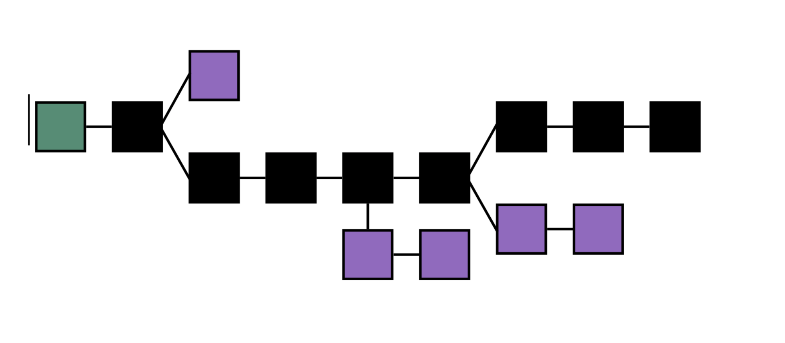
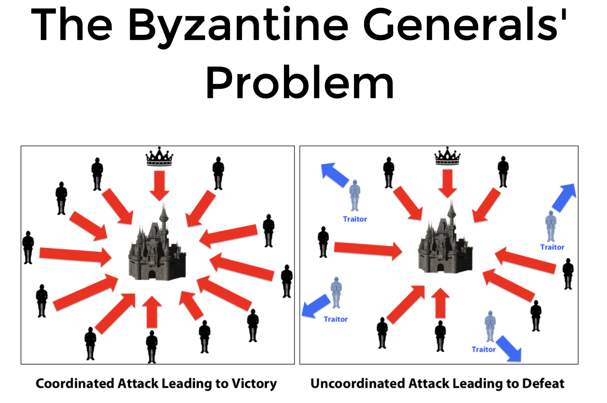
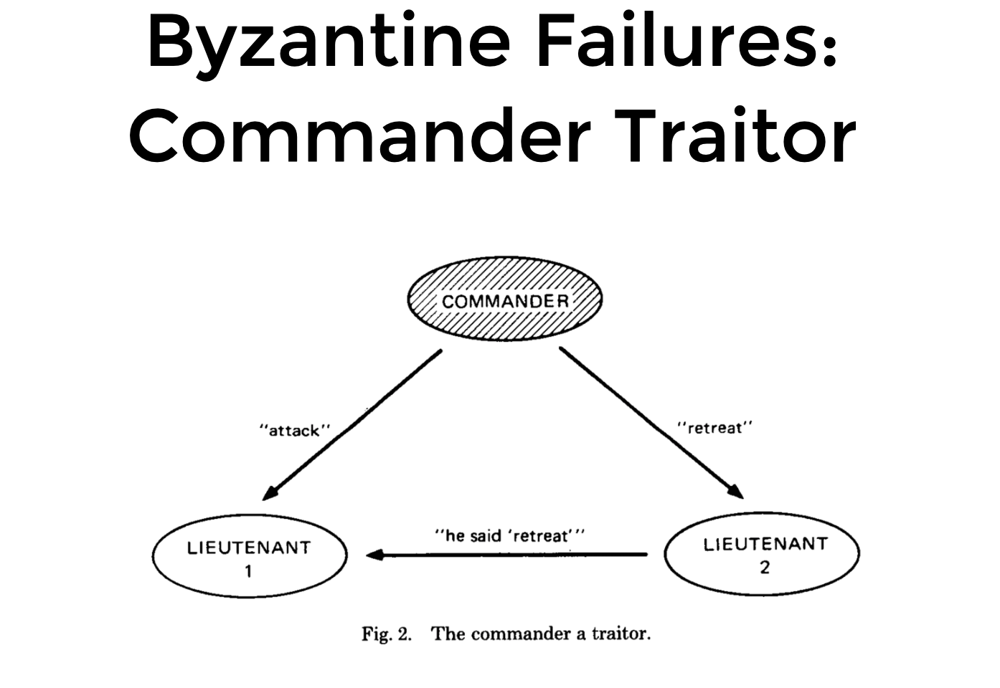
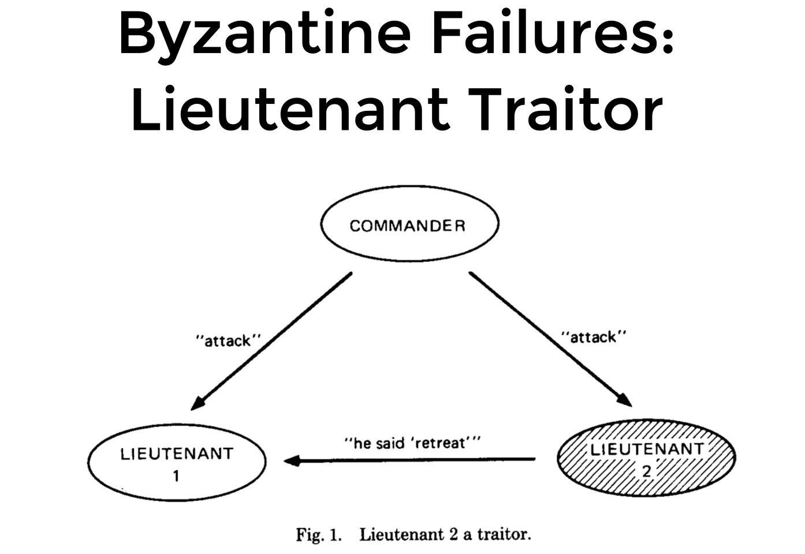

# Blokų grandinių techologijos

## 2019/2020 ruduo

### Dėstytojas Partn. Doc. Saulius Grigaitis

## 1 Paskaita

> A blockchain, originally block chain, is a growing list of records, called blocks, that are linked using cryptography.



* __Blokuose__ (pažymėti kvadratais) - saugoma svarbi informacija.
* Grandinė prasideda specialiu bloku, vadinamu __Genesis__ (pažymėta žalia spalva). Paprastai jis būna įkoduotas į klientines programas. Blokų grandinės kūrėjai į šį bloką gali įrašyti informaciją apie tam tikrą pradinį balansą savo paskyrose.
* __Konfliktas__ kyla, jei viename aukštyje (__bloko aukštis__ - kiekis blokų, esančių iki to bloko blokų grandinėje; _Genesis_ bloko aukštis yra lygus 0) atsiranda daugiau nei vienas blokas ir abu blokai yra validūs pagal protokolą.
* Jei nebūtų taisyklės, kaip išrinkti kanoninį bloką, atsirastų problema: blokų grandinės šakos vis šakotųsi - gautume ne kanoninę šaką, o medį.

### Proof of Work

* Vienas šios problemos sprendimo būdų - __Proof of Work__ protokolas.
* Visi mazgai vienu metu bando atrasti sekantį bloką (_cryptographic puzzle_ - ieškoma skaičiaus (_nonce_), kurį pridėjus prie bloko gaunamas _hash_'as, tenkinantis tam tikras savybes, pavyzdžiui prasidedantis _n_ nulių). Už šio skaičiaus atspėjimą, mazgas gauna atlygį (_reward_).

> Kriptografinė maišos funkcija (_cryptographic hash function_) priskiria argumentui maišos kodą (_hash_ arba _digest_). Argumentą pakeitus nors vienu bitu, _hash_'as smarkiai pasikeičia, todėl iš jo apskaičiuoti argumentą praktiškai neįmanoma. Geriausia taktika būtų bandyti visas kombinacijas iš eilės (_brute force_) ir atspėti.

* Jei atsiranda nesutarimų (grandinė išsišakoja) kanonine (teisinga) šaka laikoma ta, į kurią įdėta daugiau darbo (kitaip tariant ta, kuri yra ilgesnė).
* Jei mazgas A nuspręstų sukčiauti, pavyzdžiui, išsiųsti įrašą apie transakciją kitam mazgui B (_transakcija A perveda x valiutos B_), bet nepranešti kitiems (tam, jog šie manytų, kad pirmasis mazgas vis dar turi x valiutos), atsirastų dvi grandinės: viena su melaginga transakcija, o kita be. Tam, jog melaginga šaka būtų laikoma teisinga, A mazgas turėtų atspėti visų po to sekančių blokų _proof of work_. Tikimybė, jog tą padaryti pavyktų neturint bent apie 50% tinklo skaičiavimų, yra ypač maža.
* Tad kuo daugiau darbo įdedama į kiekvieną bloką, tuo didesnį saugumą galima pasiekti. Kuo daugiau skaičiavimo resursų tinklas turi, tuo jis yra saugesnis.

| Pliusai       | Minusai      |
| ------------- | -------------|
| Gerai _randomizuojamas_ blokų _produce_'inimas.      | Švaistoma labai daug energijos. |
| | Reikia daug resursų, jog tinklas būtų sąlyginai saugus. Išlieka rizika, kad kas nors turės daugiau resursų ir užvaldys tinklą. |
| | Neturi finalizavimo mechanizmo, tik produce'inimo mechanizmą. |

* Neblogas [video](https://youtu.be/bBC-nXj3Ng4) apie tai, kaip veikia _Bitcoin_'as.

### Proof of Stake

#### PoW vs PoS

| | PoW       | PoS      |
| ------------- | -------------| -------------|
| Kas turi sprendimo galią? | _Miners_ proporcingai savo skaičiavimų galiai. | _Validators_ proporcingai savo užstatytai sumai. |
| Motyvacija elgtis pagal taisykles | Blogiausiu atveju prarandami išleisti resursai (elektra ir skaičiavimo pajėgumai). | Ekonominė: rizikuojama užstatyta valiuta, dėl piktybiškų veiksmų gali smukti valiutos vertė, o tuo pačiu ir piktybinio veikėjo turtas. |

#### PoS pliusai ir minusai

| Pliusai       | Minusai      |
| ------------- | -------------|
| Mažesnė motyvacija sukčiauti. | Turtingiausi toliau turtingėja. |
| Tikimybė siūlyti bloką tiesiškai proporcinga užstatytai sumai (PoW atveju dideli žaidėjai gali naudotis masto ekonomika - kuo daugiau elektros perka, tuo mažiau ji kainuoja.) | Mažas likvidumas (užšaldomas kapitalas). |
| Ekonomiškesnis (nereikia daug el. energijos). | Nauji atakų vektoriai: _long range attack_) |

#### _Flavors_

* _Chain based_ - iš užsiregistravusių ir užstačiusių valiutą validatorių būrio pagal tikimybę, proporcingą validatoriaus užstatytai sumai, išrenkamas validatorius, kuris sukuria naują bloką. Jis taip pat gauną atlygį už bloko sukūrimą ir bloko transakcijų mokesčius. _Availability over consistency_.
* _BFT_ - iš užsiregistravusių ir užstačiusių valiutą validatorių būrio pagal tikimybę, proporcingą validatoriaus užstatytai sumai, išrenkamas validatorius _pasiūlo_ naują bloką. Tuomet likę validatoriai balsuoja, ar jie priima naują bloką, ar ne. Jei daugiau nei 2/3 validatorių balsuoja teigiamai, blokas pridedamas į grandinę. Priešingu atveju renkamas naujas bloko siūlytojas ir procesas kartojamas. Sėkmės atveju siūlytojas gauną atlygį už bloko sukūrimą ir bloko transakcijų mokesčius. _Consistency over availability_.

### CAP teorema

* Išskirstytose sistemose (_distributed systems_) galima turėti tik 2 iš 3:
  * Vientisumą (_consistency_). Kiekvienas skaitymas (_read_) gauna arba tą patį rezultatą, arba klaidą (_no response_)).
    * Aukojama dažniausiai iš visų trijų.
    * Blokų grandinėse: kiekvienas mazgas turi kanoninę šaką, tad skirtingi mazgai mato skirtingą būseną.
    * Realiame pasaulyje palaukus tam tikrą kiekį blokų, blokas yra tikimybiškai finalizuojamas - tikimybė, jog blogas bus atmestas yra labai maža.
    * _Eventually consistent_ - jei tam tikri duomenys nebebus atnaujinami, galiausiai visi skaitymai (_read_) grąžins naujausią vertę. Pavyzdžiui, būnant _offline_, pavyksta pa'_post_'inti _Facebook_'e.
  * Pasiekiamumą (_availability_) - servisas visada pasiekiamas.
    * Blokų grandinėse: galima _mine_'inti nuo _Genesis_ bloko.
    * Servisas, anot protokolo, veikia, tik nėra vientisumo (consistency).
  * Fragmentacijos tolerancija (_partition tolerance_) - ar toleruojama fragmentacija - pasiskirstymas į dalis.
    * Blokų grandinėse: priimama ta šaka, į kurią įdėta daugiausia darbo.

### Ethereum 2.0

* Nereikalauja tiek daug resursų, kadangi nenaudojamas _Proof of Work_ protokolas.
* Pasižymi labiau garantuotu blokų finalizavimu, kadangi visus, kurie daro įtaką naujų blokų gavimui, padaro dalininkais (_Proof of Stake_).
* Kad blokas būtų priimtas, už jį turi statyti validatoriai, kurie yra pastatę 32 ETH (validatoriumi tampama, užstačius 32 ETH).
  * Pavyzdys: yra 10k validatorių, kurie yra užsiregistravę ir užstatę po 32 ETH (~$6k). Visa užstatyta suma - $6M. Šia suma negalima naudotis, tačiau validatoriai gali balsuoti. Už transakciją validatorius gauna tam tikrą procentą atlygio (kadangi transakcijos kainuoja). Jei aptinkama, kad validatorius elgiasi blogai (pvz., siūlo du blokus toje pačioje epochoje) iš jo atimamas užstatas ir jis pašalinamas iš validatorių sąrašo. Pinigai paprastai sudeginami.
* Naudojamas ekonominis finalizavimas - blokai gali buti atšaukiami, tačiau kažkas tokiu atveju prarastų labai daug pinigų.
* Palaikomas trečalis piktybinių mazgų (_byzantine nodes_ - mazgai, kurie elgiasi bet kaip, pavyzdžiui, balsuoja kitaip nei yra iš tikrųjų, siunčia skirtingas žinutes). Blogiausiu atveju reikia 2/3 visų balsų, jog būtų priimtas sprendimas.
* _Tendermint_ protokole sustabdoma, jei nesulaukiama 2/3 balsų.

## 2 paskaita

### Konsensusas

> A fundamental problem in distributed computing and multi-agent systems is to achieve overall system reliability in the presence of a number of faulty processes.

* Tinklas - grafas.
* Trikiai:
  * Nepiktavališki:
    * Pavyzdžiui, tinklo trikis, _latency_, _bitflip_.
    * Jei nebūtų šių trikdžių, būtų galima išpręsti nemažai problemų.
  * Piktavališki:
    * Piktavališki mazgai - kelia nemažai problemų.
* Trikiai (_failure modes_):
  * _Crash stop_ - vienas mazgas išsijungia tokiam laikui, kad jo išsijungimą pastebėtų tinklas.
  * _Crash recovery_ - mazgas išsijungia kuriam laikui. Tam tikruose konsensuso mechanizmuose atsigavęs mazgas gali būti traktuojamas kaip visiškai naujas mazgas. Pavyzdžiui, jei nedalyvavo 5 balsavimuose, mazgas panaikinamas. Nėra būdo nustatyti, ar mazgas buvo atsijungęs piktybiškai.
  * _Omission fault_ - mazgas kažko iš dalies nepadaro. Pavyzdžiui, replikavimas - yra pagrindinis mazgas ir 10 mazgų, kurie pasiima kopiją ir ją išsisaugo pas save. Klaida padaroma tada, kai mazgas pasiima kopiją, ją išsisaugo, bet nepraneša apie sėkmę (kai kurios replikos _broadcast_ metu gali gauti duomenis, bet nepranešti centriniam serveriui, kad gavo informaciją). Jei dalinai _apsirgusios_ replikos grįžta, atsiranda keista situacija - dauguma replikų yra corrupted.
    * _R1_ patvirtina, kad gavo gera informaciją, _R2_ ir _R3_ turi _corrupted data_. Dingsta centrinis serveris, šaukiamasi pagalbos iš replikų, žiūrima, kur daugiausia sutampa duomenys (kokius duomenis turi dauguma). Jei _R2_ ir _R3_ turi vienodai nekorektiškus duomenis, o _R1_ - teisingus, teisingais laikomi _corrupted_ duomenys. \
      &nbsp;&nbsp;&nbsp;&nbsp;&nbsp;&nbsp;&nbsp;&nbsp;&nbsp;&nbsp;[C] \
      &nbsp;&nbsp;&nbsp;&nbsp;&nbsp;&nbsp;&nbsp;/&nbsp;&nbsp;&nbsp;&nbsp;|&nbsp;&nbsp;&nbsp;&nbsp;\    \
      [R1] [R2] [R3]
  * _Byzantine (arbitrary)_ - mazgas gali neatsakinėti, gali atsakinėti kitaip (piktybinis). Tačiau nebūtinai su bloga intencija, nes gali įvykti _bitflip_'as dėl radiacijos ir pan.

### Bizantijos generolo problema



* Grupės karių puola pilį. Visi kariai (arba būriai) neturi patikimo komunikacijos kanalo. Sėkmė pasiekiama tik tada, kai _visi_ nusprendžia arba pulti, arba nepulti.
* Trijų elementų pavyzdys:




> No Solution With Fewer Than 3m+1 Generals for m Traitors.

* Jei kanalas nepatikimas - nėra sprendimo, su mažiau nei _3m+1_ mazgu, kai blogiečių yra _m_.
* _Byzantine faults_ nutinka dažnai. Jei žinutės nepasirašytos, reikia 4 atskirų mazgų, kurie atpažintų vieną blogą.
* Apsisaugojimui reikia daug perteklinės įrangos. Pavyzdžiui, kosminiuose aparatuose yra trys kompiuteriai, kurie skaičiuoja tą patį.
* _pBFT (practical BFT: pre-prepare, prepare & commit). Master node sends pre-prepare messages to other nodes, nodes accept valid messages, follow-up with a prepare message for all other nodes. If a node receives the original pre-prepare message and 2f (f - faulty nodes) prepare messages, it is prepared and sends out commit message. If a node receives f + 1 commit messages, it carries out the request and sends response to client. Client waits for f + 1 responses_.
* _dBFT: (delegated BFT). For example in Neo network consensus nodes for next round are elected by all nodes, namely authorizing a few nodes to reach consensus and create new block, the other nodes will act as ordinary nodes to receive and verify blocks. This allows optimisation as the amount of nodes in network increases._
* _Distributed systems: safety vs liveness. Consensus: validity (safety), agreement (safety), termination (liveness)._

### _FLP imposiibility_ (1985)

> In a fully asynchronous message-passing distributed system, in which one process may have a crash failure it is not possible to solve the consensus problem.

* Pilnai asinchroninis tinklas su bet kiek mazgų negali pasiekti konsensuso bent vienam mazgui patyrus _crash fault_.
* FLP: galima turėti tik du iš trijų:
  * _Safety_ - the nodes agree on a valid value that was proposed by one of the nodes. _Real life example_: antras prezidento rinkimų turas, o išrenkam S. Skvernelį :)
  * _Liveness_ - the nodes eventually reach agreement. _Real life example_: pažeidimas per referendumą dėl dvigubos pilietybės - nubalsavome, bet niekas nenuspręsta.
  * _Fault tolerance_ - the system can survive a failure.

### _Timing modes_

* Synchronous model (retai sutinkamas dėl tinklų).
* Asynchronous model (FLP įrodytas tokiame tinkle: nėra laiko apribojimo žinutės siuntimui arba jos vykdymui).
* Semi-synchronous model (žinutės ne iš karto pasiekia adresatą ir yra įvykdomos, bet yra laiko apribojimai (_timeout_)).

### Teoriniai įrodymai

> Jei nėra teorinio modelio, dalykas gali veikti, bet gali ir neveikti.

| Teorinis įrodymas | Eksperimentinis įrodymas |
| ------------- | -------------|
| Įrodyta ir viskas. | Galima kažką sugalvoti ir įrodyti. Kol niekas negali eksperimentu to paneigti, mokslas priima tokią teoriją kaip teisingą. |

* Eksperimentai turi būti _repeatable_ ir _reproduceable_.

### _Whitepapers_ vs _scientific papers_

* _ICO_ bumas: whitepapers - marketinginė dalis. Naudojamas dirbtinis formalizavimas, mokslinė kalba.
* _Whitepaper_'iuose dažniausiai nebūna eksperimentų, _peer review_'ų.
* Kartais galima rasti dalinius įrodymus.

## 3 paskaita

### Praktinė dalis

* _Ethereum 2.0 specification_:
  * _BLS signatures - implementation in ethereum differs from official specification._
  * _Details might be missing from specification._
  * _Implementations:_
    * _Shasper (by Parity);_
    * _Lighthouse._
  * _YAML tests._
  * _unit tests (RUST language difficulties in unit tests)._

> MetaMask - blockchain cannot be accessed via HTTP protocol. MetaMask allows interaction with blockchain (eg - transfer tokens) via browser add-on.

### _Wallets_

* Blokų grandinės yra apsaugotos kriptografinais raktais.
* Kriptografiniai raktai negali būti perkurti (sukurti iš naujo, _recreated_).
* Sudaro du raktai: privatus (_secret key_) ir viešas (_public key_). Informacija pasirašoma (_sign_) privačiu raktu ir gaunamas parašas. Parašas gali būti verifikuojamas (_verify_) viešai prieinamu viešu raktu.
* Yra du _wallet_ tipai:
  * Kažkas kitas saugo privatų raktą (prisijungimui (prie puslapio) naudojamas el. paštas ir slaptažodis. Saugumo spraga: kas nutiks, jei raktai bus pavogti.
  * Vartotojas pats saugo raktą:
    * Faile (apsaugotame _passphrase_).
    * _Brain wallets (12 words that generate unique key)._

## 4 paskaita

* Pristatymai:
  * [Transition function](https://docs.google.com/presentation/d/19OTFduVJMW1gwOX1kVEP0JXkJbjJ1ivW7H0PlgKUc20/edit?usp=sharing)
  * [SSZ & Merkle Proof](https://docs.google.com/presentation/d/1wd00AF0U6iSKgwlj86ZgOzNvhiEM-19bWZj8mQn9c1s/edit?fbclid=IwAR02DQ-FP6SoLsh3FAteXxiJP8ST-zDlwi3LWNdI14XQzMIsst8fxkra6V8)
  * [Helper functions](https://docs.google.com/presentation/d/11jgzgwLIRGQ3s0RCnMngXSH7J7o9oWbxFn1g3ZyaAeM/edit?usp=sharing)

## 5 paskaita

* Pristatymai.

### Praktinė dalis (tęsinys)

* _Lint automatically runs by running scripts/ci._
* _Use cargo/check before ci script._

## 6 paskaita

### _Rust_ programavimo kalba

> kokia programavimo kalba jei nėra kintamųjų - HTML :-)

#### assignment

```rust
let x = 5;
```

* in case a new value might be assigned use `mut` before variables;
* `const` can't be `mut`;
* `const` can be used at global scope;
* _shadowing_ - redeclaration of variables is possible.

#### types

```rust
let x: u32 = 5;
```

* arch - depends on system (32/64 bits): `isize`, `usize`;
* number literals:
  * 98_222 - decimal;

```rust
let x = 5.00; // f64
```

* bool;
* char (UTF-8 supported);
* tuple - a set of variables (might be separate types);
* array (`[1, 2, 4];`) - **length must be known at compile time**;

#### functions

* `fn main()` - program entry point;

```rust
fn function(x: 32) -> i32 {
  // do something
  5
}
```

* last sentence without ';' and `return` statement is the result of expression;

#### control flow

* if \<condition>
* if \<condition> \<...> else \<condition>

```rust
let number = if condition {
  7
} else {
  6
};
```

* `loop`;
* `while`;
* `for element in a.iter { }`;

#### ownership

* Some languages give freedom and responsibility to programmers to allocate / free memory. Involves high risk.
* Others use GC - garbage collector (drawbacks include program *freezing*, unrecognized references etc);
* Rust uses a different approach:
  * Checks memory management at compile time (_vs runtime_);
  * Can't have two references to same object;
  * `&` marks reference;
  * `mut&` allows edits of referenced object;
  * slice `&[0..5]` allows to return part of referenced value;

#### structures

```rust
struct User {
  name: String
  username: String
  active: bool
}

let user = User {
  email: email,
  username: username,
  active: true
}

struct Color(i32, i32, i32)

impl User {
  fn activate(&self) { // method
    self.active = true
  }
}
```

* multiple `impl` are available;

#### enums

```rust
enum Coin {
  Penny,
  Nickel,
  Dime,
  Quarter
}

match coin {
  Coin::Penny => 1
  Coin::Nickel => 5
  Coin::Dime => 10
  Coin::Quarter => 25
}
```

#### option

* generic type transfering another type;
* `None`;
* `Some()`;

#### packages, crates, modules & paths

* new package - `cargo new my-project`;
* `mod` - namespaces;
* file names work as `mod`;
* `pub` makes function public (can be _imported_);
* `use crate::front_of_house::hosting;`
* `as IoResult` - alias;
* `pub use` -> re-export;

```toml
[dependencies]
rand = "0.5.5"
```

* **caution** -> different crates can use different versions. Types may interfere and show cryptic messages;

* `*` - import all;

#### generics & traits

* generic function:

```rust
fn largest<T: PartialOrd>(list: &[T]) -> T { // trait bound
  let mut largest = list[0];

  for &item in list.iter() {
    if item > largest {
      largest = item;
    }
  }

  largest
}
```

* generic struct:

```rust
struct Point<T, U> {
  x: T,
  y: U,
}
```

* generic enum:

```rust
enum Result<T, E> {
  Ok(T),
  Err(E),
}
```

```rust
impl<T> Point<T> {
  fn x(&self) -> &T {
    &self.x
  }
}
```

* traits:

```rust
pub fn notify(item: impl Summary) {
    println!("Breaking news! {}", item.summarize());
}
```

* multiple traits are separated by '`+`';

## 7 paskaita

### _Rust_ programavimo kalba (tęsinys)

#### vector

* macro to create:

```rust
let v = vec![1,2,3]
```

* variable size;
* access with `get`;
* can wrap types in enums to store different types in a single vector;

> subtle difficulties with UTF8 strings.

#### hashmap

* insert with `insert`;
* iterate:

```rust
for (key, value) in &scores { }
```

* you can override values;
* `or_insert` adds only when key does not exist;

#### error handling

* unrecoverable with `panic!`;
* stack trace with `RUST_BACKTRACE=1`;
* recoverable errors with `Result`;

```rust
enum Result<T, E> {
    Ok(T),
    Err(E),
}
```

* pattern matching;
* `unwrap_or_else`;
* propagate errors by returning `Result` and wrapping Error;
* `?` - auto propagates error;
* error can be ignored when we know it won't happen (parsing hardcoded string);
* create / access logic with private struct field and public getter;

#### lifetime

* lifetime `'a` or `'b` (can be any letter);
* usually inferred;
* might be needed when passing pointers;
* `static` lifetime (bad practice, only for things like config);

#### tests

```rust
#[cfg(test)]
  mod tests {
    #[test]
    fn it_works(){
      assert_eq!() // todo
    }
  }
```

* `assert!(x)` checks if x is true, optional message param;
* `assert_eq!(x, y)` checks equality;
* panic breaks test suit, avoid with #[should_panic] - only passes if test panics;
* error handling as usual;

#### iterators and closures

* closure:

```rust
let expensive_clojure = |num| {
  println!()...
}
```

* **doesn't require types**

* iterators impl trait with method `next`;
* after adapters (like `map`) producer (like `collect`) needs to be called;

#### smart pointers

* `Box<T>` allows self referencing structures;
* boxed values are kept in heap;
* ```vec<Box<dyn Draw>>``` allows storing obejcts that implement trait;
* loses some performance;

## 9 paskaita

### Praktinė dalis (2 tęsinys)

* lint, lint, lint
* important requirement for next task => prove that module is working correctly
* don't use `assert`s and don't `panic`

## 10 paskaita

### Concurrent programming with _Rust_

* memory safety guaranteed;
* need to join threads, otherwise main stops executing and other threads are killed;
* assign handle and `handle.join()`;
* if variables are used `move` keyword is required;

> do not communicate by sharing memory, share memory by communicating.

* mpsc::channel();
* tx - transmitter;
* rx - receiver;
* recv() is blocking;
* sent vals can't be used;
* rx treated as iterator;
* clone transmitter to use from separate threads;
* _green threads_ - created by runtime, portable, only one thread;
* _OS threads_ - not portable, but can support multiple threads;
* Rust has minimalistic runtime (OS thread 1:1 green thread);

```rust
let m = Mutex::new(5)
let mut num = m.lock().unwrap();
*num = 6;
```

* `Arc<T>` required to pass lock around threads;
* `*num += 1` is not atomicm so Arc is required;
* Send trait
* `Sync` trait

| Multiple threads       | Epoll (async/await) |
| ------------- | -------------|
| overhead (_context switching_ - resource heavy) | _event loop_ - more complicated than threads. |
| easier to program | hard to program |
| | used when multiple clients required |

* `async / await` in Rust;
* good for networking;

## 12 paskaita

* _coins_ (turi savo blokų grandinę, pavyzdžiui, _Ether_ funkcionuoja _Ethereum_ blokų grandinėje).
* _tokens_ (naudojasi egzistuojančiomis blokų grandinėmis, pavyzdžiui _Tether_ naudojasi _Ethereum_ blokų grandine).
* _Ether_: naudojamas transakcijoms / vertės pernešimui;
* _Tether_: pakankamai stabilus, kaina apie $1, simuliuoja _stable coin_. Didžiąją dalį transakcijų pagrindinėje _Ethereum_ grandinėje sudaro būtent _Tether_ transakcijos. _Tether_ buvo perkeltas į _Ethereum_ blokų grandinę iš _omni_.
* _Libra_ (Facebook project): nebelieka _crypto-anarchy_, atsiranda reguliacijos, centralizacija.

### Kontraktai realiame gyvenime

* language to specify terms of the agreement;
* a way to specify your identity and consent;
* enforcement and dispute execution;

### _smart contracts_

> _smart contract_ - a user-defined programs running on top of a blockchain. Conceptualized by Szabo in 1994.

* _smart contracts_ simulates trusted third party with shared state;
* savybės:
  * Guaranteed to execute correctly;
    * Malicious miner cannot cheat;
  * Transactions are all-or-nothing;
  * Autonomous: Enforced by network;
    * Cannot be changed or stopped, even by its creator;
  * All data is stored on the blockchain;
    * Auditable history
* _smart contract_ problema:
  * klaidos (_bugs_) turėtų būti ignoruojami (_code is law_);
  * klaidos (_bugs_) turėtų būti taisomos;
* _DAO hack_ ir _hard fork_ - kodas buvo ignoruotas (dau milijonų dolerių buvo _unfreezed_);

> Mt. Gox was a bitcoin exchange. Filed for bankruptcy after 850,000 bitcoins belonging to customers and the company were stolen.

### Panaudojimas (_use cases_)

* žetonai (_tokens_):
  * _contract_ stores everyone's balance;
  * _transfer_ moves tokens from one account to another;
* loterijos (_lotteries_):
  * _contract_ stores the end time, ticket cost, current pool, and pot;
  * If the party has enough money, add them to the pool and their money to the pot;
  * At the end, select a winner;
* draudimas;
* _cryptocurrency exchanges_;

### Traditional contracts vs. smart contracts

| | Traditional | Smart |
| ------------- | -------------| -------------|
| __Specification__ | Natural language + “legalese” | Code |
| __Identity & consent__ | Signatures | Digital signatures |
| __Dispute resolution__ | Judges, arbitrators | Decentralized platform |
| __Nullification__ | By judges | ???? |
| __Payment__ | As specified | built-in |
| __Escrow__ | Trusted third party | built-in |

### Apribojimai

* _Smart contracts_ negali būti naudojami viskam, nėra jungties su realiu pasauliu.
* Tai galima spręsti naudojant orakulus _(oracle - a trusted third party that retrieves and verifies external data for blockchains and smart contracts through methods such as web APIs or market data feeds)_.

> Ligtning network is a decentralized network using smart contract functionality in the blockchain to enable instant payments across a network of participants.

## Šaltiniai

* [Saulius Grigaitis, Partn. Doc. The Science Behind Blockchains](http://slides.com/saulius/byzantine-fault-tolerance-in-blockchains-6-9)
* [Raymond Cheng, Dawn Song. Smart Contracts](https://berkeley-blockchain.github.io/cs294-144-s18/assets/docs/02-smartcontracts-jan-29-2018-v2.pdf)
* [Blockchain at Berkeley](https://www.youtube.com/channel/UC5sgoRfoSp3jeX4DEqKLwKg)
